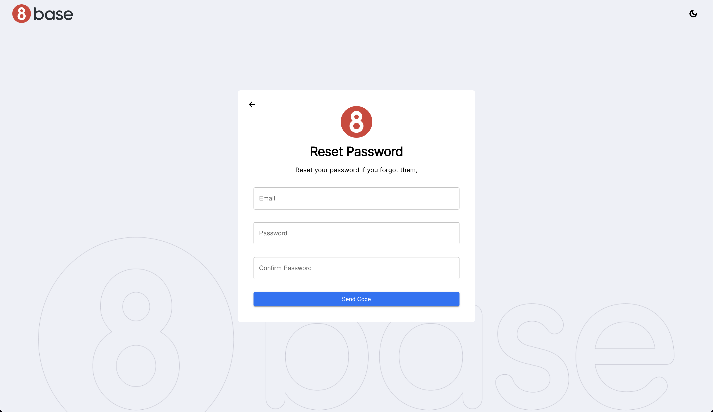

# Authentication Accelerator - Forgot Password Page



The Forgot Password page in the Authentication Accelerator allows users to reset their password in case they've forgotten it. This documentation will guide you through implementing and using the Forgot Password function, along with the necessary requests and steps for resetting a password.

## Reset Password Workflow

The "Forgot Password" functionality have some step process:

- **Request Password Reset Code**: Users initiate the password reset process by providing their email address. The requestPasswordResetCode function sends a request to generate a validation code and sends it to the user's email address.

- **Receive Validation Code**: Users receive the validation code in their email.

- **Confirm Password Reset**: Users enter the received validation code and their new password. The confirmPasswordReset function sends a request to confirm the password reset.

- **Password Reset Complete**: If the password reset is successful, users can now log in with their new password.


### Request Password Reset Code

The user provides their email address, and a request is made to generate a validation code and send it to the user's email address.

```javascript
accAuthForgotPassword.run({
  variables: {
    data: {
      email: data.email,
      authProfileId: authInfo.value.authProfileId
    }
  }
}).then(res => {
  if (res) {
    accSnackbarState.setValue({
      open: true,
      message: "Please check your email for a validation code to reset your password.",
      type: "success"
    });
  }
})
```

## Confirm Password Reset

Once the user receives the validation code, they provide it along with their new password to confirm the password reset.


```gql
mutation ResetPasswordConfirm($data: PasswordForgotConfirmInput!) {
  userPasswordForgotConfirm(
    data: $data
  ) {
    success
  }
}
```
