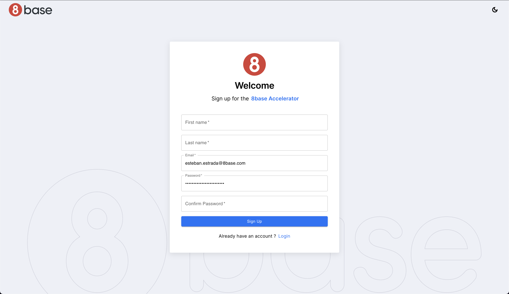
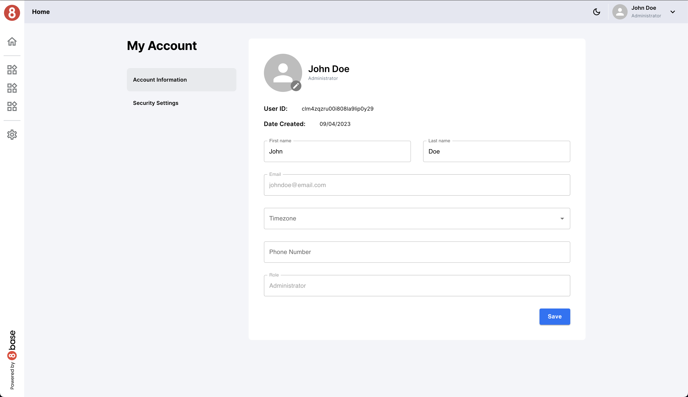

# Authentication

Authentication is a fundamental aspect of Jumpstart that allows users to access the platform, explore restricted functionalities, and manage their profiles. In this section, we'll cover how to implement login and signup functionality for your applications.

Jumpstart simplifies user login with 8base built-in authentication system.

## Login Functionality

With Jumpstart's login functionality, powered by 8base's Low-Code Development approach, users can securely access the platform:

Jumpstart provides a seamless login page with an intuitive user interface. Users can enter their credentials effortlessly.

### Credential Validation

Upon entering their credentials, the user clicks the login button. At this point, Jumpstart initiates a background process to validate the user's credentials against our secure authentication system.

### Token Generation

Once the user's credentials are verified, Jumpstart generates a secure authentication token. This token serves as a digital key to access the platform without the need for frequent username and password submissions.

### Token Validation

When the user navigates within the platform, Jumpstart automatically validates the authentication token. If the token is valid, the user is granted access to the platform's features. If it expires or becomes invalid for any reason, Jumpstart prompts the user to log in again.

## Signup Functionality

Creating user signup functionality is just as straightforward with 8base's Low-Code Development approach:

### User Registration Form

Jumpstart includes a user registration form that's ready to use. It collects all the necessary user information, such as name, email, and password.

### Backend Magic

Behind the scenes, 8base handles the backend magic for user registration. It securely stores user data, generates unique identifiers, and ensures that each user has a secure account.

### User Management

Once users are registered, they can easily manage their profiles with 8base. This includes updating their information, changing passwords, and exploring the platform's features available to registered users.

## Password Recovery

Jumpstart also includes a user-friendly password recovery feature:

If a user forgets their password, they can click the "Forgot Password" link on the login page and he will be redirected to the forgot password page.

### Email Confirmation

When user fill his email and new credentials for the password Jumpstart will send and email with a code to the registered user to validate is identity.

Once user put the code that he receive, and click on "Confirm Password Reset" his password would be reset and now he can continue using Jumpstart.

### Seamless Process

The entire password recovery process is seamless and user-friendly, ensuring that users can regain access to their accounts quickly and easily.

## Next Steps

Thanks to 8base's Low-Code Development, users can create accounts, log in, and access restricted functionalities with the click of a button. This allows developers to focus on building unique and valuable features for their applications without the hassle of manual integration.

With authentication in place, you're ready to explore other features of Jumpstart. Continue to the [Layouts](#layouts) section to learn about the available layout options and how to customize them for your application.

