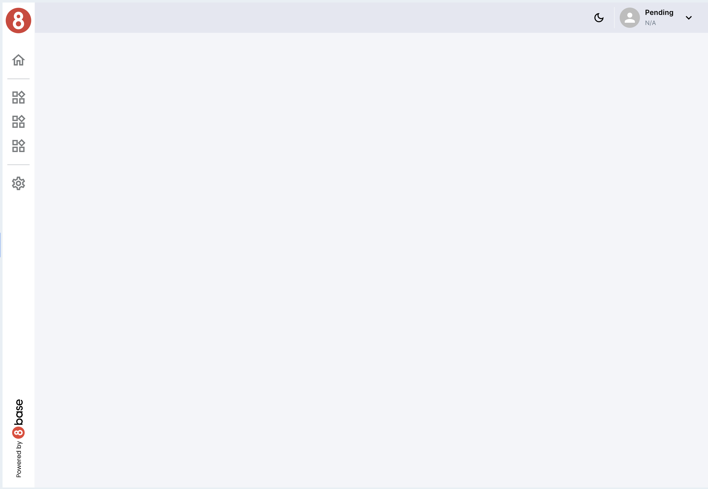
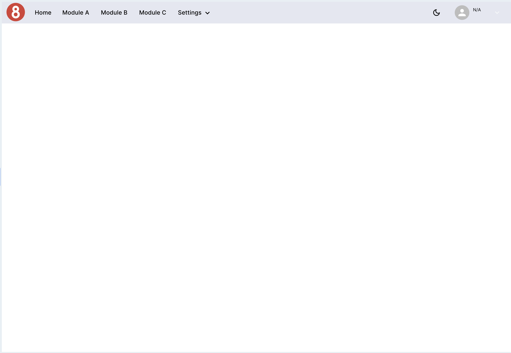
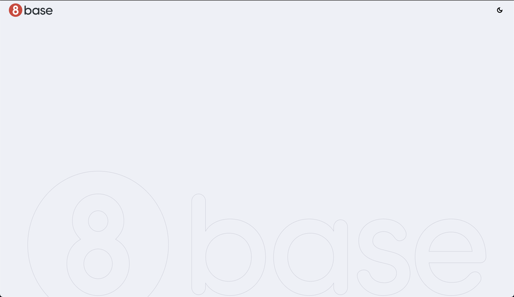
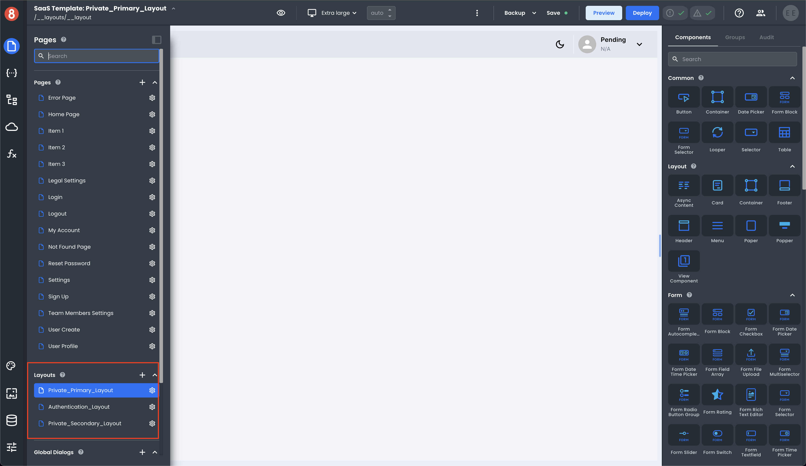

# Layouts

Layouts play a crucial role in structuring the visual appearance and organization of your application. Jumpstart provides three distinct layouts to cater to different parts of your application: one for protected routes, one for authentication pages, and an optional default protected routes layout that you can use if desired. In this section, we'll explore how these layouts work and how you can customize them to fit your application's needs.

## Jumpstart Layouts

## Private Primary Layout

The Private Primary Layout serves as the main layout for protected routes within your application. It encapsulates the core content, providing a unified structure for authenticated users to navigate the platform.

**Usage:** By default, all routes requiring user authentication automatically utilize the Private Primary Layout. This ensures that authenticated users access components enclosed within this layout.

**Customization:** Customize the Private Primary Layout to match your application's branding and style. Modify the layout's structure, color schemes, and design elements using the provided customization options.

## Private Secondary Layout

The Private Secondary Layout is an optional layout that you can use for specific sections or pages within your protected routes. It offers flexibility when you need to deviate from the primary layout structure.

**Usage:** You can opt to use the Private Secondary Layout for selected sections of your application where a different layout structure is preferred. Specify this layout for routes that require a unique presentation.

**Customization:** Similar to other layouts, you can fully customize the Private Secondary Layout to align with your application's unique requirements. Refer to the documentation for detailed customization instructions.

## Authentication Layout

The Authentication Layout is designed exclusively for authentication-related pages, such as login, signup, and password recovery. It ensures a consistent and user-friendly experience during the authentication process.

**Usage:** Authentication pages, including login, signup, and password recovery, automatically use the Authentication Layout. This layout maintains a uniform look and feel across all authentication-related pages.

**Customization:** Customize the Authentication Layout to adhere to your branding and user experience guidelines. Detailed customization instructions are provided in the documentation.

## How to Customize Layouts

Customizing layouts to match your application's branding and user experience is straightforward with Jumpstart. You can follow these general steps to customize any of the provided layouts:

To customize a layout in Jumpstart, follow these steps:

1. Open the Left Sidebar Pane.

2. Navigate to the "Pages" section in the sidebar options.

3. Scroll down if necessary to access the "Layouts" section.

5. In the "Layouts" section, you will find a list of available layouts. Select the layout that you want to start customizing by clicking on it.

This will take you to the customization interface for the chosen layout, where you can modify components, adjust structure, update styles, and make other changes to align the layout with your application's unique requirements.

Remember to save your changes once you've customized the layout to your satisfaction. You can then apply the custom layout to your application as needed.

## Next Steps

Now that you understand how layouts work in Jumpstart, you can decide which layout best suits your application and proceed to customize it as necessary. To learn more about layout customization and other features of Jumpstart, continue to the [Theme Management](#theme-management) section.
