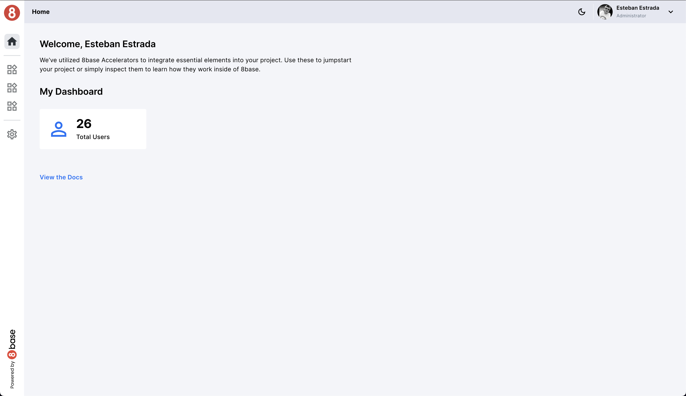

# Welcome to the Jumpstart Documentation

Welcome to the documentation for Jumpstart, your gateway to harnessing the power of 8base's Low-Code Development philosophy. We've designed this template to be your starting point for creating your own applications quickly and efficiently. Here, you will find comprehensive information to help you embark on your application development journey with ease and make the most of Jumpstart.

## Features

Jumpstart offers a wide range of features to streamline your application development process:

- **Authentication:** Implement user authentication and registration processes effortlessly with our built-in authentication system. [Learn more](#authentication)

- **Layouts:** Choose from a variety of pre-designed layouts that suit your application's requirements. Customize layouts to your heart's content. [Learn more](#layouts)

- **Theme Management:** Personalize the look and feel of your application with our flexible theme management features. Customize colors, enable dark mode, and personalize components. [Learn more](#theme-management)

- **Basic CRUD Operations:** Simplify database operations with basic CRUD (Create, Read, Update, Delete) operations. [Learn more](#basic-crud-operations)

Now, let's explore each feature in detail. Click on the links below to learn more:

- [Authentication](#authentication)
- [Layouts](#layouts)
- [Theme Management](#theme-management)
- [Basic CRUD Operations](#basic-crud-operations)
